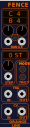
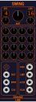
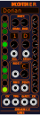

# OrangeLine
OrangeLine VCV Plugin

## Fence

### Short Description

The main function of Fence is to take a CV IN and send it to CV OUT, limited to certain range if possible.

This logically works by first substracting a defined STEP value from CV IN as long as the CV is larger than the upper limit of the range. Second, the STEP value is added to the CV as long it is smaller than the lower limit of the range.
Note that this may in a result in a CV OUT larger than the upper limit.

In quantized mode (green light), CV IN and STEP are quantized to semi tone voltages so CV OUT is quantized too. In quantized mode, STEP is working in a special way. Fence will first use a fixed step of 1V (1 octave). If the resulting cv is higher than the upper range limit, it uses STEP as alternative note.

In shaper mode (red light) Fence processes CV IN as an audio signal [-5:5]V, applying the described algorythm to the audio signal. CV OUT in SHPR mode is centered and scaled to [-5:5]V.

When the mode light is off, Fence is working in raw mode processing signals between -10 and 10 V. All voltages are used as they are without any conversion. Still output is clamped to [-10:10]V.

Fence will send a TRG OUT whenever cv out is changing.

If TRG IN is connected, Fence will not work continously but more like a S&H when a trigger in is detected.

## Swing

### Short Description

Swing is a micro timing sequencer generating a micro timed clock to implement custom micro timing the easy way.

DIV controls how many beats are created for one clock in trg. 
LEN controls how many of the 16 timing settings will be applied before looping back to the first one.
Default setup is DIV 4 and LEN 16 which is fine for 16 16th of a 4/4 bar. For a simple swing LEN 2 is sufficient. You only have to dial in the first 2 knobs in this case.
AMT controls how much the timing knobs will influence the timing. AMT = 0% switches micro timing off.
The 16 timing knobs allow to setup the timing for each beat.
RST, BPM and CLK have to be connected to your clock. Swing will not work without BPM and Clock connected !
Start with setting up Clocked and connect the CLK and BPM to swing. With DIV 4 Swing will output a micro timed 16th clk.
tCLK (timed clock) will output the micro timed clock.
eCLK (early clock) will output a trg the eraliest time tCLK can appear. Use eCLK to run sequencers delivering values used when tCLK hits.
I recommend to always do a S&H of all values needed for a step when tCLK arrives to avoid note tails.
PHS and CMP are output to allow for further timing like humanization (a module using this will come!).

## Mother

### Short Description

Mother is a probabilistic quantizer.
You can set up the notes available for the mother and its daughter scales with the buttons at the left side of Mother.
The root (lowest note) has to be always on for a mother scale, so this button is disabled.
Note on/off only can be changed for the mother scale when CHLD is set to 0. If CHLD is not 0, note on/off buttons are disabled.
Mother will detect known scales automatically and shows its name in the header.
You can setup up to 12 mother scales and select them using the SCL CV input or knob.
SCL, CHLD and ROOT inputs use quantized semiton values, so sending a C will select mother scale 1.
For each mother scale, you can set up probability weights for each note of each daughter scale.
CHLD 0 selects the mother scale itsself. CHLD N shifts note on/off and weights by position.
ROOT selects the root note of the mother scale.
Weights for daughter scales (CHLD > 0) have two special values. 50% tells Mother to use the weight of the mother scale at the same position. So if mother scale with root C has weight 100% on C (position 1 in mother scale), the daughter scale will use a weight of 100% for D (position 1 in daughter scale) if the weight of position 1 of the daughter scale is set to 50%. Blue lights indicate that weight for this note is 50% and the mother weight is used. A weight of 100% has a special meaning too (Grab). When processing of FATE hits a note with weight 100% it uses this note without further probability processing. The note light will turn red if Grab is active for that note (weight 100%).
FATE allows mother to choose notes by probability. If SPAN is 0 no probability processing is done and Mother works like a normal quantizer. With SPAN > 0 Mother will use neighbour notes and its weight to select one of them. The RND input allows to feed a seed to the internal random generator to get repeatable patterns. The internal random generator is reset to the seed at every process cycle. So you should change RND input for each trigger you send to Mother.
If TRG is connected Mother will only process CV in when a trigger is received. If TRG is not connected Mother will process on each (quantized) change of CV in. On change of CV out a gate is produced on the GATE output.
POW will output the weight of the selected note.

### Example setup:

Initialize Mother. Setup a mother major scale. Set weights for c,e,g to 100% and the other weights to 0. Leave the child scales weight at 50%. Set SPAN to max and trigger Mother using a clock. Mother will doodle on a C major chord. No sending a D to the CHLD input will make Mother play the notes of a D minor chord.

### Polyphony

Mother accepts polyphonic inputs for cvIn, random and triggers and produces polyphonic cvOut, gate and pow outputs.
The number of channels on output is the maximum of number of channels on the trigger or cvIn inputs and the auto channel number which can be setup in the right click menu.
When processing a channel it uses the according input channels for processing.
If number of cvIn channels is smaller than the number of output channels, Mother generates a random cvIn for the missing channels to process. If the number of trigger in channels is smaller than the number of output channels, the last trigger in channel will be and used as trigger in for the missing channels. If the number of random in channels is smaller than the number of output channels, Mother will continue using the random number generator seeded by the last random in channel for the missing channels.
So if setting Auto Channels to for example 4 in the right click menu and just connect a monophonic trigger at trg in, Mother will produce 4 different out channels on each trigger in using a randomly seeded random generator to randomize the 4 cvIns to process.

Have fun

*)
New modules will first show up marked as [Beta].
Beta modules are published for early adopters and should not be considered stable.
They may even disappear again if the concept behind the module doesn't work es expected.
Functionality can change and no backward compatibility is promised between beta versions of a module.
So problems with upgrading between beta versions may arise.
After collecting feedback from the community and doing the polishing of GUI and functionality, those modules will hopefully enter a stable state. When a module has reached its stable state, the [Beta] mark will disappear.
Modules not marked as beta will maintained in a backward compatible way if possible.

