# OrangeLine
OrangeLine VCV Plugin

## FENCE

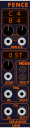

### Short Description

The main function of Fence is to take a CV IN and send it to CV OUT, limited to certain range if possible.

This logically works by first subtracting a defined STEP value from CV IN as long as the CV is larger than the upper limit of the range. Second, the STEP value is added to the CV as long it is smaller than the lower limit of the range.
Note that this may in a result in a CV OUT larger than the upper limit.

In quantized mode (green light), CV IN and STEP are quantized to semi tone voltages so CV OUT is quantized too. In quantized mode, STEP is working in a special way. Fence will first use a fixed step of 1V (1 octave). If the resulting cv is higher than the upper range limit, it uses STEP as alternative note.

In shaper mode (red light) Fence processes CV IN as an audio signal [-5:5]V, applying the described algorithm to the audio signal. CV OUT in SHPR mode is centered and scaled to [-5:5]V.

When the mode light is off, Fence is working in raw mode processing signals between -10 and 10 V. All voltages are used as they are without any conversion. Still output is clamped to [-10:10]V.

Fence will send a TRG OUT whenever cv out is changing.

If TRG IN is connected, Fence will not work continuously but more like a S&H when a trigger in is detected.

## SWING

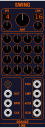

### Short Description

Swing is a micro timing sequencer generating a micro timed clock to implement custom micro timing the easy way.

DIV controls how many beats are created for one clock in trg. 
LEN controls how many of the 16 timing settings will be applied before looping back to the first one.
Default setup is DIV 4 and LEN 16 which is fine for 16 16th of a 4/4 bar. For a simple swing LEN 2 is sufficient. You only have to dial in the first 2 knobs in this case.
AMT controls how much the timing knobs will influence the timing. AMT = 0% switches micro timing off.
The 16 timing knobs allow to setup the timing for each beat.
RST, BPM and CLK have to be connected to your clock. Swing will not work without BPM and Clock connected !
Start with setting up Clocked and connect the CLK and BPM to swing. With DIV 4 Swing will output a micro timed 16th clk.
tCLK (timed clock) will output the micro timed clock.
eCLK (early clock) will output a trg the earliest time tCLK can appear. Use eCLK to run sequencers delivering values used when tCLK hits.
I recommend to always do a S&H of all values needed for a step when tCLK arrives to avoid note tails.
PHS and CMP are output to allow for further timing like humanization (a module using this will come!).

## MOTHER

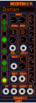

### Short Description

Mother is a probabilistic quantizer.
You can set up the notes available for the mother and its daughter scales with the buttons at the left side of Mother.
The root (lowest note) has to be always on for a mother scale, so this button is disabled.
Note on/off only can be changed for the mother scale when CHLD is set to 0. If CHLD is not 0, note on/off buttons are disabled.
Mother will detect known scales automatically and shows its name in the header.
You can setup up to 12 mother scales and select them using the SCL CV input or knob.
SCL, CHLD and ROOT inputs use quantized semitone values, so sending a C will select mother scale 1.
For each mother scale, you can set up probability weights for each note of each daughter scale.
CHLD 0 selects the mother scale itsself. CHLD N shifts note on/off and weights by position.
ROOT selects the root note of the mother scale.
Weights for daughter scales (CHLD > 0) have two special values. 50% tells Mother to use the weight of the mother scale at the same position. So if mother scale with root C has weight 100% on C (position 1 in mother scale), the daughter scale will use a weight of 100% for D (position 1 in daughter scale) if the weight of position 1 of the daughter scale is set to 50%. Blue lights indicate that weight for this note is 50% and the mother weight is used. A weight of 100% has a special meaning too (Grab). When processing of FATE hits a note with weight 100% it uses this note without further probability processing. The note light will turn red if Grab is active for that note (weight 100%).
FATE allows mother to choose notes by probability. If SPAN is 0 no probability processing is done and Mother works like a normal quantizer. With SPAN > 0 Mother will use neighbor notes and its weight to select one of them. The RND input allows to feed a seed to the internal random generator to get repeatable patterns. The internal random generator is reset to the seed at every process cycle. So you should change RND input for each trigger you send to Mother.
If TRG is connected Mother will only process CV in when a trigger is received. If TRG is not connected Mother will process on each (quantized) change of CV in. On change of CV out a gate is produced on the GATE output.
POW will output the weight of the selected note.

Example setup:

Initialize Mother. Setup a mother major scale. Set weights for c,e,g to 100% and the other weights to 0. Leave the child scales weight at 50%. Set SPAN to max and trigger Mother using a clock. Mother will doodle on a C major chord. No sending a D to the CHLD input will make Mother play the notes of a D minor chord.

## PHRASE

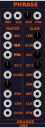

### Short Description

Phrase is a Phrase Sequencer but has for itself no sequencing capabilities. Instead, Phrase uses one external sequencer (master) to provide information on the sequence of phrases to feed another sequencer (slave). The slave sequencer has to have to ability to store multiple patterns (slave patterns) and to switch between them by providing a pattern cv input. Your patches will use the outputs of the slave sequencers channels.

The master sequencer provides three cv values for each phrase. The starting patterns cv value, the length of the pattern and the duration the phrase should play. If the duration is longer then the length, the pattern is repeated.

The LENgth knob tells Phrase the native number of steps the slave sequencer provides. If the length of the pattern given by the master sequencer is greater than LEN, the slave sequencer is advanced to the next pattern by adding the value of the INCrement knob to the current slave pattern cv.

After a phrase is played (duration past) the master sequencer is clocked to provide the information on the next phrase to play. Since the master sequencer may need a number of samples to provide the cv outputs, the processing of the master sequencer inputs is delayed by the number of samples provided by the DLY knob.

If the pattern length provided by the master is 0V, the length defaults to the value of the LEN knob. If the phrase duration provided by the master sequencer is 0V it defaults to the pattern length.

### The Panel

#### Top Row

RST: Reset trigger cv input from your patch (usually clock)

CLK: Clock trigger cv input

DIV: Knob to select the clock division Phrase should run with

PTN: Pattern cv input to select master sequencer patterns (allows for nesting of Phrases)

#### Left Column

RST: Master reset trigger output

CLK: Clock trigger out (triggered when next phrase information is needed)

PTN: Master sequencer pattern cv output, copied from top row PTN input when master CLK out is sent.

DLY: Number of samples to wait after master CLK out is sent before processing the master input cv

DLEN: Default pattern length input used if LEN below is not conncted or 0V 

DUR: Input for phrase duration (cv = #clockTicks/100) 

PTN: Knob for master pattern CV or offset if connected and master pattern CV input for slave sequencer start pattern cv

LEN: Input for the pattern length (cv = #clockTicks/100), if not connected or 0V, defaults to DLEN, if connected or right column slave LEN knob 

DUR: Input for phrase duration (cv = #clockTicks/100)

#### Right Column

LEN: Knob to set number of steps of the slave sequencer used

ELEN: Effective default pattern length from copied from left columns DLEN input if connected, or (LEN knob above * top rows DIV knob) / 100 otherwise.

INC: Knob to set the voltage increment used to advance the slave sequencers next pattern

DLY: #Samples the slave clock and reset outputs below shall be delayed

SPH: Trigger output signaling the start of a new phrase

SPA: Trigger output signalling the start of the pattern

RST: Reset trigger output to connect to the slave sequencers reset input

CLK: Clock trigger output to connect to the slave sequencers reset input

PTN: Pattern cv output to select the slave sequencers pattern

### Right Click Menu

The right click menu offers the usual option including the selection of three different panel style.

Since the trowasoft sequencer are not compatible on pattern cv in itself, there is a trowa pattern offset fix selectable which add a slight offset to the pattern cv provided by the master sequencer.

## DEJAVU

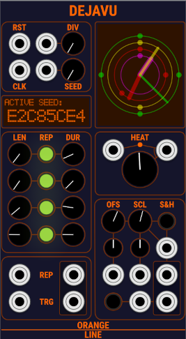

### Short Description

Dajavu is a polyphonic source for random gates/triggers as well as random cv.
It provides polyphonic output for up to 16 channels of trigger/gates and cv each. 
The number of channels provided can be set in the right clock menu of the module. 

Its unique property is the ability to repeat the generated random sequences in up to 4 levels of nested phrases. Why ? Random generative patterns are much more accepted when there is a good amount of recognition of something heard before.

Repitition justifies!

Example:

A simple Random generator generates values: ASDIGUEOIRJHSVMCXNSIEKZTAGSFDHD.... which is a chaotic sequence with no structure.
Dejavu allows to generate : ASDI GUEO ASDI GUEO IRJH SVMC IRJH SVMC ... and more up to 4 nesting levels of repetition.

If you are familiar with Frozen Wastelands 'Seeds of Change' and 'The Gardener', you will be nearly all the way to understand Dejavu.
On the bottom end, Dejavu is logically a chain of 4 'Gardeners' with its respective 'Seeds Of Change' seed source plus all the cabling and 
logical processing to sample and hold cv and trigger outputs. Thus Dejavu can free up a whole row some patches and frees a lot of CPU so.

### The Panel

#### Top Left Section

RST: Reset trigger cv input from your patch (usually clock)

CLK: Clock trigger cv input

DIV Input: CV input for DIV, if connected DIV knob will be ignored, input CV is scaled by factor 10 (6.4V represents the max DIV of 64) 

DIV Knob: Selects the clock division Dejavu should run with, if DIV input is not connected

SEED CV Input: Global Seed to initialize Dejavu an Reset. Scales by factor 1000 (9.999V represent the max seed of 9999) The resulting seed is clamped to [0..9999]

SEED Knob: Defines the starting seed Dejavu should reset to on RST und TRG trigger input

#### Left Display

The left display shows the current active seed, the random generator used to initialize the seeds of all generators needed for the outputs,
was last initialized with. It changes whenever the lowest active REP row reaches its end of duration. The random generator is reset to the this same seed whenever the lowest active REP row reaches its end of length.

If a knob is turned, the display switches to give a feedback of the current value of the moving knob for some time.

#### Middle Left Section

This section contains 4 rows to define the (nested) repetition of the generated random value stream. 
A row is active if it is switched on with the respective LED in the middle of the row and either LEN or DUR of this row is != 1. 
Each row holds a random generator to provide a seed for the active random generator row above or 
the active random generator for output seed initialization. 
On each end of duration (DUR length) the row initializes its random generator from a seed of an active row above or 
the global random generator if it is the highest active row. In this case, the random generator will start to create a new sequence of randoms. 
On each end of length (LEN length) the random generator is reset to the seed it was initialized last.
This will start to deliver the same sequence of seed to its lower row or the out processing random generator as after its last LEN end.

LEN Knob: Define the length of the random sequence to repeat.

LED Button: Switch this row on or off, the LED is dimmed if a row is on but inactive because both LEN and DUR are set to 1

DUR Knob: Define the total length of the phrase. It is typically a multiple of LEN but other values are working as well. If lower than LEN, the sequence will never reach its end of length because it is terminated before by the lower DUR. If DUR is greater that LEN, Dejavu will just generate the same sequence as after the last len/dur end again.

The rows 2 to 4 will interpret their LEN und DUR values as multiples of the DUR length of the active REP row above. Having a DUR of 64 set for the first row and we set a LEN of 2 and a DUR of 4 in the second row, this will result in an effective LEN of 64 x 2 = 128 and an effective DUR of 64 x 4 = 256 for the second row. The effective value of DUR will again provide the unit for the rows below.

#### REP Input/Output Section

REP input: Polyphonic input to control the LEN and DUR of the 4 rows in the repeater section above

Channels: 

0: LEN Value for repeater row 1

1: DUR Value for repeater row 1

2/3, 4/5, 6/7 as above LEN/DUR for repeater rows 2,3 and 4

REP input CVs are interpreted in the same way as the knobs and scaled by a factor of 100 (0.64V represents a length of 64 clockticks or multiples).

All channels with cv < 1V and are ignored but allow any other length as long the effective length does not exceed max float.

TRG input: trigger input to reset all counters to 0 ignoring any offset settings , not the same than reset, because reset sets offsets if configured

REP output: Polyphonic cv outputs for the effective DUR/LEN of each row.

Channel 0 = DUR 1, Channel 1 = LEN 1, Channel 2 = DUR 2, ... . Values are scaled by a factor 10.000. so 10V represents an length of 100.000 clockticks.

TRG output: Polyphonic trigger output for end of length (channel 0,2,4,6) and duration (channel 1,3,5,7) for the 4 repeater rows.

#### Right Display

A visualization of Dejavus repeat state. All active repeater rows are represented by a circle of dots and an associated clock hand.
Inactive rows (switched off or both LEN and DUR of the row is 1) will not get displayed.
The outermost active ring is associated to the uppermost active REP row which feeds and resets the random generators producing all outputs 
for triggers/gates and CV to its current active seed.
The inner rings are associated with the lower active REP rows, which feed and reset the random generator of the next active outer ring with its current active seed.
Whenever it hits the 12:00 dot an end of duration event has occurred and a new seed is fetched from the random generator of the next inner active ring 
or the global never repeating random generator if it is the innermost ring. 
After fetching the next seed from the next inner ring, the next outer ring is reset to the seed just fetched and an it will start a new random sequence.
Whenever the hand reaches another dot, an end of length event has occurred and the random generator of the next outer ring is reset to its starting seed and its random sequence starts to repeat.

#### Heat Section

HEAT Knob: The HEAT knob defines the global probability of output triggers to be fired on each clock tick.

Left CV input: Polyphonic input for probabilities for the GATE output channels (bottom right output).

Right CV input: Attenuation input for the HEAT Knob (NOT the CV input!). defined how the HEAT knob will change the value given by the LEFT CV input.

The HEAT knob is kind of a macro knob for trigger probabilities of all channels. If no cv input connected it defines the probability from 0 to 100% for all channels the same.
When the polyphonic HEAT offset cv is connected (left of HEAT knob) the HEAT knob is just added to the cv given for each channel. Putting Heat to 0, and connect a KnolyPobs to the HEAT offset gives you 12 HEAT knobs for each channel.
When the polyphonic HEAT scale cv is connected (right of HEAT knob), it defines the amount of probabilities the HEAT knob is adding to the probabilities for each channel. So if no HEAT offset cv is connected it defines the maximum probability for each channel when the HEAT knob is put to 100%.
Both knobs cv inputs for offset and scale can be combined. If scale is negative, raising the HEAT knob will in fact reduce the probability for that channel.

Normally if you have a cv input, you have two knobs to dial in the offset and scale for the cv input. With DEJAVU HEAT it's just the other way around. The cv inputs for offset and scale tell DEJAVU for each polyphonic channel the offset and scale for the HEAT knob.

#### Output Section

OFS Knob: Offset of the CV values to be generated

OFS CV input: Polyphonic input to set OFS per cv output channel

OFS Attenuation Trimpod: Attenuator for the CV input

SCL Knob: Scale of the CV output to be generated

SCL CV input: Polyphonic input to set SCL per cv output channel

SCL Attenuation Trimpod: Attenuator for the CV input, positive (unipolar), negative (bipolar) 

S&H Button. Switches whether a cv change on output should occur on every clock tick (S&H off), on each step if a trigger or gate is generated (S&H yellow) or only when a trigger output or new gate on that channel occurred (s&h red).

S&H Input: Polyphonic input for S&H per channel. If the S&H input channel is < 1V, the cv output for this channel changes on on every clock tick. If the S&H input channel is >= 1V and < 2V, the cv output for this channel changes for every trigger or gate generated only. If the S&H input channel is >= 2V, the cv output for this channel changes for every trigger or a new gate generated only. 

GATE Button: Defines whether the trigger output generates triggers (off), gates (yellow) or contiguous gates(red)).

GATE INPUT: Polyphonic GATE input. Defines GATE/TRG for each poly channel. < 1V is trigger mode, >=1 and < 2 is gate mode (new gate on every clock tick) and on >=2 the gate stays on contiguously for postitive following gates.

CV Output: (Upper bottom right) Polyphonic CV output

GATE_Output: (Bottom right) Polyphonic Trigger/Gate output.

## GATOR

### Short Description

Gator is a polyphonic, phase based gate generator. For all of its timing it uses a phase which is a ramp from -10V to 10V of the length of your sequencers clock resolution.
For example running on 1/16 (clock x 4) the phase is assumed to start 1/32 before the 1/16 clock at -10V and end 1/32 after the 1/16 clock at 10V. The zero crossing is assumed to be in time with your 1/16 clock. To generate a trigger at the output, an input gate is required. So when just patching 10V to the GATE input of Gator and connect the phase from Swing, Gator will produce 1/16 beats in sync with your clock. Typically you run a gate sequencer on the early clock of Swing to select the 1/16 steps to play. THE Len Knob allows to set the Gate length of the gates Gator generates. The LEN input allows to control the gate length per step using a step sequencer, best running on the early clock of Swing. Notable is, that a gate LEN can span multiple phases to play longer notes up 100 phase lengths. 

The TIME input allows to offset the threshold value used to detect a gate to generate in the range of -95% to +95% of a half phase length. So shifting notes nearly 1/32 forward and backward in time is possible. I decided to avoid the 100% because it would be very easy to generate missing notes due to overlapping gates. Needless to say that this CV can also be sequenced to achieve a per step timing of the gates.

The JIT CV input and knob allow to humanize the gates by applying a random offset to the threshold making the gates out of sync by the amount given by those parameters and inputs.

The Rachet section with its knobs and inputs (RAT/DLY) controls the ratcheting. RAT is the number of additional gates to produce and DLY the time between the gates in phase lengths. The delay itself can not be as large as the Gate LEN but about two phase lengths are possible. The number of ratchets selected by the RAT knob and input can be up to 10.

Important to say that GATE, LEN, TIME, JTR, RAT and DLY inputs are polyphonic with the GATE input defining the number of the output channels Gator will run. Gator is able to control the timing, gate length, jitter as well as the ratcheting for up to 16 voices independently.

As an additional feature, Gator can apply a strum timing to the gates of the polyphonic output. The time and direction (negative values strum up, positive values strum down) can be controlled by the STR knob and input. This is not polyphonic by nature because it already influences all polyphonic channels. Note that also strumming can span cross phase borders.

Any strumming or ratcheting is aborted if a later gate on the same channel starts a new gate event when crossing its give tie threshold.

### The Panel

PHS input: Clock Phase typical easiest to get from OrangeLie Swing

CMP input: Global threshold for general timing like swinging also best take from Swing 

GATE input: [polyphonic] The phase crossing the timing threshold will generate a gate (or more due to ratcheting) only if the GATE of the channel is high.

LEN knob: Gate length in units of phase length [0(min trg len) up to 100 phases] (ignored if LEN input is connected).

LEN input: [polyphonic] CV input for gate length 0.1 V is one phase. 10V is 100 phases.

JTR knob: humanization jitter applied to gate threshold 0%, accurate timing , 100% very sloppy. (ignored if JTR input is connected).

JTR input: [polyphonic] Jitter input. values < 0 are ignored 10V is 100% sloppiness.

RAT Knob: Number of additional gates to generate [0..10]. (ignored if RAT input is connected).

RAT input: [polyphonic] cv input for the number gates to generate 1V is 1.

DLY Knob: Time between additional gates to generate [0..10]. (ignored if RAT input is connected).

DLY input: [polyphonic] cv input for the time between the gates to generate 1V is 1.

STR knob: Controls strumming. 0 position no strum timing is applied. All bates of the polyphonic output channels are offset to each other by a strumming offset given by the knob value. If positive the lower channels will get gates first and higher channels latest. If negative its vice versa.

STR input: strum control CV input

RST input: Reset. clears all ongoing gates, ratcheting and strumming.

Output: [polyphonic] The gate output of Gator

## RESC

### Short Description

Resc is a polyphonic, pitch transposer, transposing a pitch given in a source scale to a target scale/child harmonically by determining the pitch position in the source scale and outputting the pitch at the position of the target scale.

### The Panel

IN input: [polyphinic] Pitch given in the source scale to transpose to the target scale.

SCALE[Cmaj] input: [polyphonic] Source Scale. The channels contains the pitches of the scale. 

TARGET SCALE input: [polyphonic] Target Scale. The channels contains the pitches of the scale.

TARGET CHILD input: [polyphonic] Child of Target Scale to use as effective Target Scale. The channels contains the pitches of the scale.

OUT BASE ROOT: [polyphonic] Transposed pitch based on the Root TARGET SCALE without respecting the TARGET CHILD input. 

OUT BASE CHILD: [polyphonic] Transposed pitch based on the TARGET child SCALE respecting the TARGET CHILD input. 

CHILD SCALE: [polyphonic] Pitches of the TARGET child SCALE (TARGET root Scale rotated by TARGET CHILD.

## MORPH (deprecated)

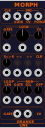

### Short Description

Morph is a gate and cv looper with turing machine functionality. It is fully polyphonic except of the CLK input. It features two ring buffers of 65 steps max for gates and cvs with a play head for each polyphonic channel. The channel play head handles both of buffers. On each clock tick the play head is advanced one step. Before advancing the play head, Morph checks for an replacement events for one or both of its channel loop buffers and processes them. A replace event is triggered if the SRC_FORCE gate for the channel, or randomly depending on the setting of the three knobs in the LOCK section. When a replace event occurs for a loop buffer the loop buffers content of the play head pointing to is replaced. In case of a SRC_FORCE for the channel, gate and cv values from the SRC inputs are copied to the loop buffers for that channel independent of other settings. In case of a LOCK originated replace event Morph determines where the new value(s) should come from depending on the setting of the S<>R knob or input. If the values are determined to come from the SRC inputs, the gate and/or cv values are read from SRC inputs. If the values should come from the internal random generator, the RND_GATE knob or input defines the probability a gate is produced and RND_SCL and RND_OFF knobs and inputs are used to generate a random CV from the internal random generator. After processing replace events, the gate/cv values from the play head position of the buffers are sent to the outputs and the play head is advanced one step. Buttons and inputs allow for shifting the play head(s) forward and backward as well as clearing the loop(s) buffer.
MORPH is deprecated and MORPHEUS should be used instead.

### The Panel

#### Top Input Section

CLK input: [monophonic] Clock driving Morph.

SRC_GATE input: [polyphonic] Source Gate. 

SRC_CV input: [polyphonic] Source Cv. 

SRC_FORCE input: [polyphonic] If high the source gate and cv a forced pushed through to the loop channel buffer overriding other processing for the channel. 

#### LOCK Section

LOCK_GATE knob,
LOCK_GATE input: [polyphonic] [0-10V] Determines whether a replace event for the gate buffer loop for a channel has to occur. LOCK_BOTH values are added.

LOCK_BOTH knob,
LOCK_BOTH input: [polyphonic] [-10-10V] Value to add to LOCK_GATE and LOCK_CV values.

LOCK_CV knob,
LOCK_CV input: [polyphonic] [0-10V] Determines whether a replace event for the Cv buffer loop for a channel has to occure. LOCK_BOTH Values are added.

#### Control Section

S<>R knob,
S<>R input: [polyphonic] [0-10V] 0V MORPH get new data on replace events from src only. 10V from random only. Between mixed.

<<,>> buttons,
<<,>> inputs: [polyphonic] Shift the loop left (<<) or right (>>)

CLR button,
CLR input: [polyphonic] Clear loop (all gates off, cv to 0V).

#### Lower Input Section

LOOP LEN knob,
LOOP LEN input: [polyphonic] [0-6.4V] * 10 = Number of steps to loop (max 64).

RND GATE knob,
RND GATE input: [polyphonic] [0-10V] probability of generating a gate on a replace event fetching from random.

RND SCL knob,
RNDSCL input: [polyphonic] [-10-10V] scale/10 for random cvs. Negative values bipolar. Positive values unipolar.

RND OFF knob,
RND OFF input: [-10-10V] offset to add to the scaled random cv.

#### Outputs

GATE output: [polyphonic] Gate output

CV output: [polyphonic] CV output

## MORPHEUS

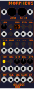

### Short Description

Morpheus is cv looper with turing machine and memory functionality which is able to mutate a sequence or morph 
between sequences. The heart of MORPHEUS is a 16 channel polyphonic cv sequencer loop with a maximum length of 128 steps.
The length of each channels loop can be different by using the polyphonic LEN input of MORPHEUS. On each clock input MORPHEUS uses 
the LOCK knobs value or the individual channels of the polyphonic LOCK input to randomly decide whether the correct step should be
mutated or stay as it is. If it decides to mutate the step, the S<>R knob value or the the value of the corresponding
polyphonic S<>R input is used to determine where the replacement value should come from. If the new value should be taken from the 'source' the active memory slot or the external polyphonic SRC input (if the EXT button is switched on) is used the get the new step value(s).
If the new value should be randomized it uses the SCL and OFS knobs and corresponding polyphonic inputs to randomize and scale the
new step value. Negative SCL will result in bipolar, cv centered at OFS, positive SCL will create unipolar cv with OFS as lowest value.
If OFS is set to -10V and the SCL is negative (bipolar) MORPHEUS will create a bipolar, cv centered at the current steps value.
Note that SCL and OFS are used when calculating the new random cv. So the result will be stored as step cv value.
MORPHEUS also can output gates or triggers (settable in right click menu). The GTP knob and its polyphonic input thereby defined the cv threshold the current steps cv has to cross to create a gate. The higher the GTP value the lower the cv has to be, so creating more gates.
Vice versa the lower the GTP value, the higher the cv value has to be to create a gate, so resulting in less gates to produce. So changing
the GTP does not alter the step sequence in any way but sill allows for output between 0% and 100% gates. Since it depends in the current cv value GTP is not directly a probability but since the cv is created randomly it indirectly is.
The HLD button freezes the channels steps, so no change will be applied to the step. Also the step loop of a channel on hold is not
overwritten when loading from a memory slot. Using the HLD input, you can select which channels to be on HLD individually.
The buttons RND, <<, >>, CLR affect ALL channels except channels on HLD. The RND and CLR buttons are temporary, so they can used to affect only the current position of the step loops while pressed. If the corresponding polyphonic inputs are used only the gated channels will be affected by the operation. RND forces the current step to be randomized. CLR will initialize the current step to the channels OFS value. <<,>> shift the step loop left and right respectively.
When a nice loop was created, the polyphonic step loop can be stored to one of the 16 memory slots by selecting the slot with the up and down buttons and pressing of STO. When selecting a memory slot with up and down buttons, the slot display will show the new slots number in red. This indicates that MORPHEUS still is using the previous active memory slot as a source for its replacement operations. 

When pressing RCL while the slot is displayed red, it will set the displayed slot as the new active slot for step replacement. So if not locked an S<>R < 50% the cannel with morph to the new memory slots stored loop. When pressing RCL while the display is not red, the whole loop of the memory slot is loaded to the step loop immediately. This allows for unmorphed pattern switching.

The EXT button switches the source for replacement to the polyphonic SRC input. So you can use MORPHEUS to mutate a sequence coming in
from another sequencer or midi. The REC button and its polyphonic inputs can be used to force MORPHEUS to replace the current steps value(s) be the external CV value(s), thus recording the external source to the step loop. While EXT is on, you can sill save the current loop to a memory slot but RCL will have no effect on the current step loop.

### The Panel

#### Top Section

LOCK knob: Controls the probability of MORPHEUS will replace a step. 0% forces change of every step, 100% no change of step.

LOCK input: [polyphonic] [LOCK/10, 0..10V] is added to LOCK knobs value for each channel.

S<>R knob: Controls the probability of MORPHEUS will replace from source or randomize. 0% only use source, 100% alwas randomize.

S<>R input: [polyphonic] [S<>R/10, 0..10V] is added to s<>R knobs value for each channel.

#### MEM Section

LEN knob [1-128]: Length of the step loop

LEN input [polyphonic] [LEN/100, 0.01..1.28]: overrides the LEN knob per channel. LEN knobs value is used if LEN input for a channel is 0V.

up, down buttons: select memory slot store or recall.

MEM display. Shows selected memory slot. If the active memory slot if a different one the number is displayed in red.

MEM input [monophonic] [slot/10, 0.1..1.6]: activate memory slot by cv. If the right click menu option 'Load on Mem CV Change' is set, the mem slot is not only activated but loaded instantly. 

STO button: Store current loop to selected memory slot. sets active slot to be the selected one.

STO input [monophonic]: trigger STO if > 0.V is given.

RCL button: Make the selected memory slot the active on. Load step loop from memory if selected and active memory slot already match. Channels on HLD will not be loaded.

RCL input [monophonic]: trigger RCL if > 0.V is given.

#### EDIT Section

HLD button: Freezes all channel steps ignoring HLD input.

HLD input [polyphonic]: Freezes individual channels steps if HLD value > 0.

RND button: Randomize all channel steps while RND is pressed, ignoring RND input. Channels on HLD will not be randomized.

RND input [polyphonic]: Randomize individual channels steps while HLD value > 0.

<<,>> buttons: shift all steps of all channels left or right. Channels on HLD will not be shifted

<<,>> inputs [polyphonic]: shift individual channels if cv > 0V.

CLR button: Clears all channel steps (step is set to channels OFS value) while CLR is pressed, ignoring CLR input. Channels on HLD will not be cleared.

CLR input [polyphonic]: Clear individual channels steps while HLD value > 0.

#### EXT and Random Section

EXT button: Use the SRC input as source for non random replacement instead of active memory slot.

EXT input [polyphonic]: external cv input to process as source or record

REC button: Momentary button to force EXT input to be recorded to the step loop.

REC input [polyphonic]: Force record of individual channels if REC cv is > 5.0V

GTP knob: Gate 'probability'. Threshold at which the current steps cv generated a gate

GTP input [polyphonic]. GTP values for individual channels. Input overrides knob if a value is present for that channel.

SCL knob: Scale for randomly generated cv values. Negative bipolar, positive unipolar.

SCL input [polyphonic]. SCL values for individual channels. Input overrides knob if a value is present for that channel.

OFS knob: Offset for randomly generated cv values. Negative bipolar, positive unipolar.

OFS input [polyphonic]. OFS values for individual channels. Input overrides knob if a value is present for that channel.

#### Input/Output Section

RST input [monophonic]: Trigger input for Reset. Sets the head position of all step loops to 0.

CLK input [monophonic]: Trigger input for Clock

SRC output [polyphonic]: Values of the current EXT cv if EXT is on, or active memory slot if EXT is off

GATE output [polyphonic]: Gate out (can be switched to Trigger in right click menu)

CV out [polyphonic]: Value of the current step of the step loop.

### Right Click Menu

Output Trg instead of Gate:  If set, MORHEUS will output Triggers instead of Gates

Recall on Mem CV Change: If set do a RCL wen MEM input CV changes

Load on Mem CV Change: If set does a load (lie RCL pressed twice) wen MEM input CV changes

Smart HLD:If set, any low HLD channel will be held and edit actions affect only channels with high HLD

MEM is Note: MEM CV uses V/Oct CV to select MEM slots.

Channels: Set number of polyphonic output channels to produce  

## BUCKETS

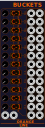

### Short Description

Bucket is a polyphonic splitter which takes takes a pair of polyphonic V/Oct and Gate inputs and copies each channels V/Oct and Gate to one of the 13
V/Oct and Gate  output pairs depending on the input channels V/Oct (Pitch) value.
There 12 are rows with a knob, a pitch display and the polyphonic output pair for V/Oct and Gate. The input is processed the following way.
For each channel CRON start at the top row and checks whether the channels input pitch is lower or equal the pitch setup with the rows Split point knob and displayed in the rows display. If so, the V/Oct and Gate of this input channel is added to the rows output V/Oct and Gate pair. In this case CRON continues with processing the next input channel. So there is always only one output channel an input channel is copied to. If not, the next row is checked. If non of the 12 setup split points is larger or equal the input V/Oct, the V/Oct and Gate are added to the bottom output pair beside the inputs. This way multiple instances can be chained. 

### The Panel

There are 12 rows with:

Split point Knob: Set the split point for this row

Split point Display: Displays the pitch value for spit point dialed in wih the knob.

Controls the probability of MORPHEUS will replace a step. 0% forces change of every step, 100% no change of step.

V/oct output [polyphonic]: Output for pitch for this row.

Gate output [polyphonic]: Output for Gate for this row.

In the Bottom row you find:

V/oct Input [polyphonic]: Output for pitch.

Gate Input [polyphonic]: Output for Gate.

V/oct Output [polyphonic]: Output for pitch for pitches larger than the pitch setup for any row.

Gate Output [polyphonic]: Output for Gate for pitches larger than the pitch setup for any row.

## CRON

### Short Description

CRON is a utility for handling transport and clock from a MIDI>CV or similar MIDI interface module. Is main purpose is to determine BPM by tapping the 24ppm MIDI CLK to provide it to a SWING module. It uses START, STOP and CONT signals to determine running status and uses CLK and CLK/N to tap tempo and for synchronization of local and MIDI clock. It calculates current the V/Oct BPM value and outputs it at the BPM output. The RUN output is high while running. CLK/N input is copied to the CLK/N output for convenience. The RST output puts out a reset trigger.

Additionally CRON has the ability to support up to 16 different latency corrections for different destinations in BOTH directions. Meaning it can correct for positive and negative latency. It takes the input CMP value from for example SWING and calculates the CMP values for GATOR instances to produce latency corrected gates. The calculated values are sent to the polyphonic CMP output. A CHL channel Knob lets you select the channel you want setup the latency with the LATENCY knob below.   

### The Panel

## Upper Section (Clock)

CLK/N and CLK input: MIDI clock inputs

BPM output: The tapped and calculated BPM V/Oct value

CLK output: MIDI CLK/N outputs

## Middle Section (Trancport)

START, STOP and CONT input: Transport from MIDI

RST output: Reset Trigger on START.

RUN output: Gate output which is high if running

## Bottom Section (Latency)

CHL knob and display: Channel selection to edit latency below

LATENCY knob: Kob to dial in the latency in milliseconds for the selected channel above.

LATENCY display: Shows the latency in milliseconds,

CMP input: Reference CMP value from SWING

CMP output [polyphonic]: Latency corrected CMP values for each channel

## LANES

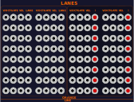

### Short Description

LANES merges up to 16 polyphonic sources (e.g. multiple sequencers or performance controllers) into 16 independent output lanes, each intended to feed one external CV>MIDI interface. It replaces a CPU-heavy interpreted-script approach with a native, control-rate implementation.

Each of the 16 sources provides a V/Oct, Gate, Velocity and Lane input. The Lane input is a V/Oct-like CV (1 semitone = 1 lane, 0V = Lane 1) that selects which of the 16 output lanes a given note-channel is routed to. LANES allocates each lane's polyphonic output dynamically: when a note-on arrives for a lane, LANES either merges it into an already-active voice of the same pitch on that lane (so the same note is never sent twice to the same downstream MIDI interface), reuses a free channel, or grows the lane's channel count. Velocity is fixed at the moment a channel is first (re)allocated and set back to 0 once the last contributing note releases it.

If a lane already uses all 16 of its channels and a new, distinct pitch needs one, LANES steals the oldest active note on that lane for it (classic voice stealing) - the stolen note does not come back on its own even if its gate is still held, it stays silent until re-triggered or until its lane/pitch input changes. While any held note on a lane has no channel (freshly overflowed or waiting after being stolen from), that lane's OVERFLOW output and light stay active as a continuous state, not a one-shot pulse.

A lane's channel count only ever grows on demand and only shrinks again from the end, one tick after the last channel's gate has already been sent out as low - so a downstream CV>MIDI interface is guaranteed to see an explicit gate-off before a channel can disappear from the polyphonic cable, avoiding hung notes.

### The Panel

16 source blocks (left half), each with:

V/OCT input [polyphonic]: Pitch for this source's note-channels.

GATE input [polyphonic]: Gate for this source's note-channels.

VEL input [polyphonic]: Velocity for this source's note-channels.

LANE input [polyphonic]: Per note-channel CV selecting the destination lane (1 semitone = 1 lane).

16 lane blocks (right half), each with:

V/OCT output [polyphonic]: Pitch of the notes currently allocated to this lane.

GATE output [polyphonic]: Gate of the notes currently allocated to this lane.

VEL output [polyphonic]: Velocity of the notes currently allocated to this lane.

OVERFLOW output and light: High/lit while this lane currently has more distinct notes wanting it than it has channels for.

## K2C

### Short Description

K2C routes incoming polyphonic notes to 16 fixed output channels by exact pitch match, replacing a patch of 2x BUCKETS chained together with 3x M16 to merge the split channels back into one polyphonic cable. Unlike BUCKETS, which splits by knob-defined pitch ranges, K2C matches each of its 16 output channels against an exact, CV-defined target pitch, so every channel has a fixed, addressable note identity - handy for feeding a fixed drum rack or a MIDI interface where each channel is wired to a specific destination.

KEYS defines the target pitch for each of the 16 output channels. If fewer than 16 channels are connected, K2C continues chromatically (+1 semitone per channel) from the last connected value. If KEYS is not connected at all, the 16 channels default to a chromatic run starting at C4.

For every note-channel on the main input, K2C scans all 16 input V/OCT channels and, if the (quantized) input pitch matches a channel's target pitch (KEYS), routes that note's gate and velocity there. If several input channels match the same KEYS pitch, the last (highest-index) one scanned wins. Notes that don't match any of the 16 KEYS pitches are ignored. Each output channel's V/Oct always reflects its fixed KEYS pitch, whether or not a note currently matches it - only GATE and VEL turn on/off as notes come and go.

### The Panel

V/OCT input [polyphonic]: Pitch of the incoming notes to route.

GATE input [polyphonic]: Gate of the incoming notes to route.

VEL input [polyphonic]: Velocity of the incoming notes to route.

KEYS input [polyphonic]: Target pitch for each of the 16 output channels, chromatic fallback from C4 if unconnected or partially connected.

V/OCT output [polyphonic]: Fixed target pitch of each of the 16 output channels.

GATE output [polyphonic]: Gate for each of the 16 output channels, high while a matching note is held.

VEL output [polyphonic]: Velocity for each of the 16 output channels, valid while GATE is high.

## CC14

### Short Description

CC14 converts between MIDI's 7 bit CC resolution (0-10V representing 0-127) and 14 bit CC resolution (0-10V representing 0-16383), in both directions at once. It's monophonic and stateless - both conversions are fully recomputed every control-rate tick.

MSB IN and LSB IN are combined into a single 14 bit value (msb * 128 + lsb) and sent to CV OUT, still scaled to 0-10V but now at 14 bit resolution - use this to combine two paired 7 bit MIDI CCs (like many MIDI>CV interfaces provide for CC pairs such as 0/32) into one fine-grained CV.

CV IN takes a 0-10V CV representing a 14 bit value and splits it back into its MSB and LSB 7 bit components at MSB OUT and LSB OUT - the exact inverse of the above, for sending a 14 bit CV out as a pair of standard 7 bit MIDI CCs.

### The Panel

MSB IN input: 7 bit MIDI CC CV (0-10V = 0-127) - most significant byte to combine.

LSB IN input: 7 bit MIDI CC CV (0-10V = 0-127) - least significant byte to combine.

CV OUT output: Combined 14 bit CV (0-10V = 0-16383).

CV IN input: 14 bit CV (0-10V = 0-16383) to split.

MSB OUT output: 7 bit MIDI CC CV (0-10V = 0-127) - most significant byte of CV IN.

LSB OUT output: 7 bit MIDI CC CV (0-10V = 0-127) - least significant byte of CV IN.

## D2D

### Short Description

D2D (DrumsToDejavu) sits between a drum sequencer and DEJAVU's HEAT section, replacing manual per-hit CV math in the patch. It's polyphonic and stateless, with a fixed 1:1 channel mapping (channel N in, channel N out, no reordering) since its inputs are expected to already come from a fixed-channel source like K2C.

For each channel, while GATE is high and VEL is greater than 0V, incoming VEL is split by range: values above 5V go to the "offset" half, values at or below 5V go to the "scale" half. Whichever half the value falls into is rescaled back up to the full 0-10V range, then the velocity curve is applied (SHAPE CV, normally bipolar [-5:+5] where 0 is linear, or unipolar 0-10V as delivered by MIDI CC if the "Unipolar Curve" right click option is enabled - shape is then remapped from 0-10V to [-5:+5] by subtracting 5V). This curved value is what VEL OUT always reports, regardless of which half fired.

HEATOFF OUT is a plain 0V/10V gate for the "offset" half - no curve, no attenuation, it outputs 10V whenever velocity input is greater than 5V. HEATSCL OUT is the curved value from the "scale" half, further linearly scaled by ATTEN - only this half gets attenuated. In the typical patch, HEATOFF OUT and HEATSCL OUT feed DEJAVU's HEAT OFFSET and HEAT SCALE inputs directly.

### The Panel

GATE input [polyphonic]: Gate from the drum sequencer.

VEL input [polyphonic]: Velocity from the drum sequencer.

ATTEN input [polyphonic]: Heat scale attenuation, linearly scales HEATSCL OUT.

HEATOFF output [polyphonic]: Plain gate (0V/10V) for velocities above 5V, intended for DEJAVU's HEAT OFFSET input.

HEATSCL output [polyphonic]: Curved and attenuated CV for velocities at or below 5V, intended for DEJAVU's HEAT SCALE input.

SHAPE input [polyphonic]: Velocity curve shape, bipolar [-5:+5] (0 = linear) by default, or unipolar 0-10V if "Unipolar Curve" is enabled in the right click menu.

VEL output [polyphonic]: The processed velocity (split, rescaled and curved, before any heat attenuation), for use as the actual note velocity elsewhere in the patch.

### Right Click Menu

Unipolar Curve: If set, SHAPE is read as unipolar 0-10V (as MIDI CC delivers it) instead of bipolar [-5:+5], and remapped accordingly.

## CC2CV

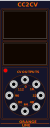

### Short Description

CC2CV receives MIDI CC messages and outputs them as CV, covering the entire 0-127 CC range in a single module. Unlike VCV Core's MIDI-CC module, which exposes 16 individually MIDI-learnable monophonic rows, CC2CV uses a fixed, non-learnable mapping across 8 polyphonic outputs of 16 channels each: channel c of output bank N always corresponds to CC number `N*16+c` (bank 1 = CC 0-15, bank 2 = CC 16-31, and so on up to bank 8 = CC 112-127). The 8 output jacks are arranged in a circle on the panel and wired clockwise starting at the top, so the banks advance clockwise around the ring.

Each CC's raw 7 bit value (0-127) is scaled to 0-10V. By default the stepped 7 bit resolution is smoothed into a continuous CV (exponential filter, snaps instantly on large jumps so MIDI buttons still feel immediate) - this can be turned off in the right click menu. The last known value of every CC is remembered and restored on patch reload, so you don't have to touch the physical controller again after reopening a patch.

The CC grid lets you click any of the 128 cells (16 columns x 8 rows, cell = CC row*16+column) to enable or disable that CC individually, or click and drag to paint the same on/off state across every cell the drag passes over - a disabled CC's output is forced to 0V no matter what's received, so unused/noisy controller CCs don't pollute the rest of the patch. Cell brightness also flashes on incoming MIDI traffic for that CC regardless of its enabled state (green for enabled, a muted red for disabled - still visible but clearly different), so the grid doubles as a live activity display. The on/off mask is remembered across patch reload.

### The Panel

MIDI Display: Driver/device/channel selector for the MIDI input to receive from.

CC Grid: 16x8 grid, one cell per CC, click to enable/disable, click and drag to paint the same on/off state across every cell the mouse passes over. Blue = enabled, black = disabled; green flash = incoming traffic on an enabled CC, red flash = incoming traffic on a disabled one (still visible, so you can tell a muted CC is still receiving something). Disabled CCs output 0V.

CC 0-15 .. CC 112-127 outputs [polyphonic, 8x]: arranged clockwise from the top of the ring. Bank N's 16 channels carry CC N*16 through N*16+15 as 0-10V.

### Right Click Menu

Smooth CC: If set (default), CC values are smoothed with an exponential filter instead of stepping in raw 7 bit increments.

## CV2CC

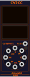

### Short Description

CV2CC is the reverse of CC2CV: it sends CV as MIDI CC messages, again covering the entire 0-127 CC range in a single module via 8 polyphonic inputs of 16 channels each, with the same fixed mapping (channel c of input bank N = CC number `N*16+c`), arranged in the same clockwise-from-top ring as CC2CV. No MIDI learn - the mapping is always fixed.

Each channel's 0-10V CV is converted to a 7 bit CC value (0-127) and sent as a MIDI Control Change message, but only when that CC's value actually changed since the last time it was sent, and rate-limited to at most 200 updates per second overall - both to avoid flooding the MIDI output if many CCs are modulated at once. A disconnected input bank, or channels beyond what a connected poly cable actually carries, are treated as 0V.

FORCE (trigger input) and FLUSH (panel button) both do the same thing: force every one of the 128 CCs to be resent on the next update, bypassing the change-detection - useful to resync an external device or DAW without having to wobble a CV to fake a change. By default the same thing also happens automatically once, the first time the module processes after being added to a patch, loaded with a patch, or right click Initialized - this can be turned off in the right click menu if you'd rather nothing gets sent until something actually changes.

The CC grid lets you click any of the 128 cells (16 columns x 8 rows, cell = CC row*16+column) to enable or disable that CC individually, or click and drag to paint the same on/off state across every cell the drag passes over - a disabled CC is never sent, no matter what the CV does or whether FORCE/FLUSH fires, so unused CCs don't pollute the outgoing MIDI stream. Re-enabling a CC immediately resends its current value on the next update rather than waiting for a change. Cell brightness flashes whenever the CC's value changes - green if enabled (a message was just sent), a muted red if disabled (nothing was sent, but the value is still moving), so you can tell a muted CC is still doing something even though it's never transmitted. The on/off mask is remembered across patch reload.

### The Panel

MIDI Display: Driver/device/channel selector for the MIDI output to send to.

FORCE input: Trigger to force an immediate resend of all 128 CCs.

FLUSH button: Same as FORCE, as a panel button.

CC Grid: 16x8 grid, one cell per CC, click to enable/disable, click and drag to paint the same on/off state across every cell the mouse passes over. Blue = enabled, black = disabled; green flash = a message was just sent, red flash = the CV changed but nothing was sent because the CC is disabled. Disabled CCs are never sent, no matter what the CV does.

CC 0-15 .. CC 112-127 inputs [polyphonic, 8x]: arranged clockwise from the top of the ring. Bank N's 16 channels (0-10V) are sent as CC N*16 through N*16+15.

### Right Click Menu

Flush On Start: If set (default), every CC is force-sent once the first time the module processes after being added, loaded, or Initialized - matching VCV Core's CV-CC behavior. If unset, nothing is sent until a CV value actually changes (FORCE/FLUSH still always work regardless).

## RECALL

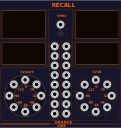

### Short Description

RECALL combines CC2CV's MIDI receive and CV2CC's MIDI send into a single module (its own MIDI IN/OUT, no separate CC2CV/CV2CC instances needed) and gates the bidirectional connection (e.g. to touchOSC) so it stays receive-only during normal operation, avoiding MIDI feedback loops - and only pushes Rack's own data back out as a deliberate sync burst, on demand or once at startup.

Internally it's a simple chain: MIDI IN -> Hold1 -> RX OUT (to the rest of the patch) -> optional external Infix -> TX IN -> Hold2 (snapshots on every sync) -> TX OUT (always shows Hold2's snapshot) -> optional external Infix -> RX IN (overrides what's sent) -> MIDI OUT. There are 8 banks of 16 channels each (same fixed CC mapping as CC2CV/CV2CC: channel c of bank N = CC N*16+c), each with 4 ports:

- **RX IN**: normally unconnected. Overrides, per channel, what the embedded MIDI-send stage actually sends - when unconnected, it sends Hold2's snapshot instead. Patch an external Infix here (typically tapping TX OUT) to inject continuous live data outside of a sync.
- **RX OUT**: to the rest of the patch. Tracks the incoming MIDI live while not syncing; freezes at its last value while syncing, so the patch doesn't react to a controller that's still catching up mid-sync.
- **TX IN**: optional override for Hold2's snapshot source. If a cable is connected on a sync's rising edge, Hold2 snapshots that value instead of RX OUT's current (about-to-freeze) value - useful for resetting specific CCs to a patch-calculated default on every sync.
- **TX OUT**: always shows Hold2's snapshot (regardless of the TX grid's mute state, so an external tap/Infix still sees the true value even when muted).

"Syncing" is true whenever GATE IN is high, SYNC is held, or the (optional) autosync-on-start window is active - these are all level-gates, not one-shot triggers, so a sync lasts for exactly as long as whatever's driving it stays asserted. GATE IN/SYNC have a dual function: besides gating Hold1/Hold2 as above, the *rising edge* of syncing also force-resends every CC via the embedded MIDI OUT - Hold2 takes its fresh snapshot first, then the resend is forced, so the guaranteed full resend actually carries the new snapshot rather than stale values from before the sync.

No built-in send/receive bus beyond the RX IN/TX IN override points above - to tap or inject elsewhere in a large patch, use an external module like Stoermelder-P1's Infix.

Like CC2CV/CV2CC, RECALL has two CC grids for muting individual CCs (16 columns x 8 rows, cell = CC row*16+column, click or click-drag to paint): the RX grid mutes what reaches RX OUT (forced to 0V when disabled, regardless of what's still being received - like CC2CV's own grid), the TX grid mutes whether a CC is actually sent by the embedded MIDI OUT (like CV2CC's own grid - TX OUT's jack itself is unaffected). Both grids flash activity (green if enabled, muted red if disabled) whenever the underlying value changes, so a muted CC's ongoing traffic stays visible on either side. Both masks are remembered across patch reload, along with Hold1's and Hold2's held values and the MIDI device selections - all packed compactly (one byte per CC, base64-encoded) rather than as 128 individual JSON numbers, since `dataToJson()` runs fairly often (autosave, undo/redo history).

### The Panel

Two MIDI interface widgets sit at the top (MIDI IN on the left, MIDI OUT on the right), each with the usual driver/device/channel selection. RX IN sits on the right-hand ring (styled to match a CV2CC-type input ring, since it feeds the MIDI-send stage), RX OUT on the left-hand ring (toward the rest of the patch). TX IN and TX OUT are the two middle columns (TX IN left, TX OUT right of it, both read top-to-bottom for banks 0-7).

GATE input: External sync/force-resend gate - see "Syncing" above.

SYNC button: Same dual function as GATE input, held with the mouse.

RX Grid, TX Grid: 16x8 grids for muting individual CCs on the receive/send side respectively - see above.

### Right Click Menu

Autosync On Start: If set (default), the module forces a sync for a short fixed window (0.5s) the first time it processes after being added, loaded, or Initialized - independent of GATE IN/SYNC.